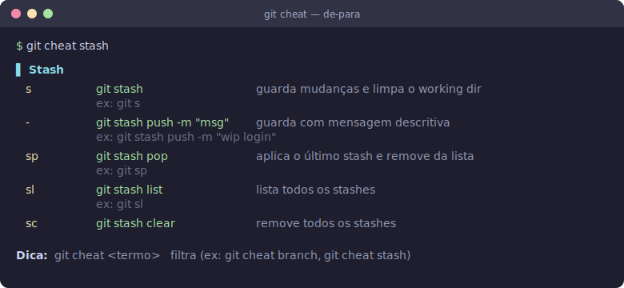

# Setup Mac Dev — ambiente de terminal + Git

[](https://github.com/ianfagundes/setupTerminal/actions/workflows/lint.yml)


Script único e idempotente que replica todo o ambiente de terminal/Git em um Mac novo,
do zero ao estado final: Oh My Zsh, plugins do Zsh, aliases do Git e uma "cola" de comandos.

Arquivo: `setup-mac-dev.sh`

---

## Como usar

No Mac novo:

```sh
git clone https://github.com/ianfagundes/setupTerminal.git
cd setupTerminal
./setup-mac-dev.sh
```

> Se a máquina já tiver chave SSH cadastrada no GitHub, pode clonar via
> `git clone git@github.com:ianfagundes/setupTerminal.git`.

Ele pede seu **nome** e **e-mail** do Git (única interação). Ao final, abra um
**terminal novo** (ou rode `source ~/.zshrc`) para ativar tudo.

### Modo 100% automático (sem perguntas)

```sh
GIT_USER_NAME="Seu Nome" GIT_USER_EMAIL="voce@email.com" ./setup-mac-dev.sh
```

### Flags

| Flag | O que faz |
|------|-----------|
| `--ssh-key` | gera uma chave SSH `ed25519` (se não existir), adiciona ao agent e mostra a pública para você cadastrar no GitHub |
| `--no-backup` | não cria os arquivos `.bak.<timestamp>` ao sobrescrever |
| `--clean-backups` | roda normalmente e, no final, **apaga** os backups gerados nesta execução |
| `-h`, `--help` | mostra a ajuda |

Exemplos:

```sh
./setup-mac-dev.sh --no-backup        # nem cria backup
./setup-mac-dev.sh --clean-backups    # cria, usa e remove os backups ao terminar
./setup-mac-dev.sh --ssh-key          # também gera/mostra a chave SSH p/ o GitHub
```

---

## O que é instalado/configurado

| # | Item | Detalhe |
|---|------|---------|
| 1 | Pré-requisitos | confere `git` e `curl`; avisa (sem travar) se faltar Homebrew |
| 2 | **Oh My Zsh** | instalação unattended (pula se já existir) |
| 3 | **Plugins Zsh** | `git`, `zsh-autosuggestions`, `zsh-syntax-highlighting`, `zsh-autocomplete` |
| 4 | **`~/.gitconfig`** | identidade + dezenas de aliases + alias `cheat` |
| 5 | **`~/.gitignore`** global | macOS / Xcode / editores |
| 6 | **`~/.git-cheat.sh`** | cola de-para (`git cheat` / `gcheat`) |
| 7 | **`~/.zshrc`** | linha `plugins=(...)` + bloco custom (autocomplete, Ruby no PATH, alias `gcheat`) |

---

## A "cola" de comandos (de-para)



Depois de instalado:

```sh
git cheat            # mostra todos os comandos: atalho -> comando real -> o que faz -> exemplo
git cheat branch     # filtra por um termo
git cheat stash
gcheat push          # mesmo que `git cheat`, atalho de terminal
```

Saída (ex.: `git cheat stash`) — colorida no terminal:

```text
▌ Stash
  s         git stash                                    guarda mudanças e limpa o working dir
            ex: git s
  -         git stash push -m "msg"                      guarda com mensagem descritiva
            ex: git stash push -m "wip login"
  sp        git stash pop                                aplica o último stash e remove da lista
            ex: git sp
  sl        git stash list                               lista todos os stashes
            ex: git sl

Dica:  git cheat <termo>   filtra (ex: git cheat branch, git cheat stash)
```

### Exemplos de atalhos do Git criados

| Atalho | Comando | O que faz |
|--------|---------|-----------|
| `git st` | `status` | estado dos arquivos |
| `git lg` | `log --oneline` | histórico compacto |
| `git graph` | `log --oneline --graph --all` | histórico visual |
| `git swc <branch>` | `switch -c` | cria e troca de branch |
| `git unstage <arq>` | `restore --staged` | tira do stage |
| `git amend` | `commit --amend --no-edit` | junta mudança ao último commit |
| `git pfl` | `push --force-with-lease` | force seguro |
| `git cheat` | — | abre a cola |

> Lista completa: rode `git cheat`.

---

## Segurança e repetição

- **Idempotente**: pode rodar várias vezes. A linha de `plugins=()` não se multiplica e o
  bloco custom do `.zshrc` (entre os marcadores `# >>> dev-setup >>>` e `# <<< dev-setup <<<`)
  é substituído, nunca duplicado.
- **Backup automático**: tudo que é sobrescrito (`.gitconfig`, `.zshrc`, `.gitignore`,
  `.git-cheat.sh`) vira `arquivo.bak.<timestamp>` antes de mudar.
- **Não inclui o lazygit**.

---

## O que o script NÃO faz

- Não copia repositórios.
- Não cadastra chave **SSH** no GitHub por você. Mas com `--ssh-key` ele gera a chave
  `ed25519` (se não houver), adiciona ao agent e imprime a pública pra você colar em
  https://github.com/settings/ssh/new. Manualmente seria:

  ```sh
  ssh-keygen -t ed25519 -C "voce@email.com"
  eval "$(ssh-agent -s)"
  ssh-add ~/.ssh/id_ed25519
  # depois adicione a chave pública (~/.ssh/id_ed25519.pub) no GitHub/GitLab/Azure
  ```

- Não instala o Homebrew automaticamente. Se faltar e você quiser o Ruby do Homebrew:

  ```sh
  /bin/bash -c "$(curl -fsSL https://raw.githubusercontent.com/Homebrew/install/HEAD/install.sh)"
  brew install ruby
  ```

---

## Personalizar a cola

Edite o bloco `DATA` dentro de `~/.git-cheat.sh`, no formato:

```
Seção|atalho|comando real|o que faz|exemplo de uso
```

Use `=` no campo do atalho quando o comando não tiver um atalho próprio.

---

## Desfazer / restaurar

Cada execução gera backups com timestamp. Para voltar ao estado anterior, é só restaurar:

```sh
cp ~/.gitconfig.bak.<timestamp> ~/.gitconfig
cp ~/.zshrc.bak.<timestamp> ~/.zshrc
```

---

## Licença

[MIT](LICENSE) © Ian Fagundes
