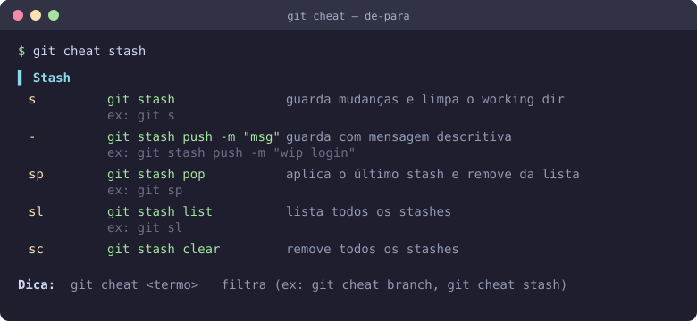

# setupTerminal — ambiente de terminal (macOS)

[](https://github.com/ianfagundes/setupTerminal/actions/workflows/lint.yml)


Dotfiles + `Brewfile` que reproduzem meu terminal do zero num Mac novo: **zsh + starship**,
git-delta com diff **lado a lado tema Dracula** e clique-pra-abrir-no-VS-Code, mais um punhado
de ferramentas modernas de CLI (`fzf`, `zoxide`, `eza`, `bat`, `fd`, `ripgrep`, `direnv`,
`lazygit`) e uma "cola" de comandos git (`git cheat`).

Sem Oh My Zsh: a config vive num único `dev.zsh` rápido, versionado aqui.

---

## Como usar

```sh
git clone https://github.com/ianfagundes/setupTerminal.git
cd setupTerminal
./install.sh
```

O script instala o Homebrew (se faltar), roda `brew bundle`, pergunta **nome** e **e-mail**
do git (única interação) e **linka** os dotfiles pra sua `~`. Ao final, abra um terminal novo
(ou `source ~/.zshrc`).

### Sem perguntas

```sh
GIT_USER_NAME="Seu Nome" GIT_USER_EMAIL="voce@email.com" ./install.sh
```

### Flags

| Flag | O que faz |
|------|-----------|
| `--copy` | copia os dotfiles em vez de criar symlink |
| `--ssh-key` | gera chave SSH `ed25519` (se não existir) e mostra a pública p/ cadastrar no GitHub |
| `--no-backup` | não cria `.bak.<timestamp>` ao sobrescrever |
| `--clean-backups` | apaga, ao final, os backups gerados nesta execução |
| `-h`, `--help` | ajuda |

---

## Estrutura

```
setupTerminal/
├── install.sh                 # instala brew tools + linka dotfiles (idempotente)
├── Brewfile                   # ferramentas de CLI (brew bundle)
└── dotfiles/
    ├── zshrc                  # enxuto: só faz source do dev.zsh + ~/.zshrc.local
    ├── gitconfig              # aliases + delta (Dracula) + cheat; identidade via include
    ├── gitignore              # ignore global (macOS/Xcode/editores)
    ├── git-cheat.sh           # cola de-para (git cheat / gcheat)
    └── config/
        ├── iterm2/dev.zsh     # o coração: history, completions, fzf, zoxide, aliases, funções
        ├── starship.toml      # prompt
        └── bat/config         # bat com tema Dracula
```

### Onde cada arquivo é linkado

| Repo | Destino |
|------|---------|
| `dotfiles/gitconfig` | `~/.gitconfig` |
| `dotfiles/zshrc` | `~/.zshrc` |
| `dotfiles/gitignore` | `~/.gitignore` |
| `dotfiles/git-cheat.sh` | `~/.git-cheat.sh` |
| `dotfiles/config/iterm2/dev.zsh` | `~/.config/iterm2/dev.zsh` |
| `dotfiles/config/starship.toml` | `~/.config/starship.toml` |
| `dotfiles/config/bat/config` | `~/.config/bat/config` |

---

## Ferramentas (Brewfile)

| Tool | Pra quê |
|------|---------|
| `starship` | prompt |
| `git-delta` | diff turbinado (Dracula, side-by-side, links VS Code) |
| `gh` | GitHub CLI (também é credential helper do git) |
| `fzf` | fuzzy finder (Ctrl-T arquivos, Ctrl-R histórico, Alt-C dirs) |
| `zoxide` | `cd` inteligente por frequência |
| `eza` | `ls` moderno (ícones + git) |
| `bat` | `cat` com syntax highlight (Dracula) |
| `fd` / `ripgrep` | find/grep modernos |
| `direnv` | `.envrc` por diretório |
| `lazygit` | TUI de git (`lg`) |
| `zsh-autosuggestions` / `zsh-syntax-highlighting` / `zsh-completions` | realce do zsh |

---

## git-delta — diff turbinado (tema Dracula)

O [delta](https://github.com/dandavison/delta) substitui o pager do git e deixa `git diff`,
`git show` e `git log -p` muito mais legíveis. Já vem ligado:

| Recurso | Config | Efeito |
|---------|--------|--------|
| Tema | `delta.syntax-theme = Dracula` | syntax highlight roxo/rosa no diff |
| Lado a lado | `delta.side-by-side = true` | antes \| depois em duas colunas |
| Números de linha | `delta.line-numbers = true` | colunas de linha (ciano) |
| Navegação | `delta.navigate = true` | pula entre arquivos com `n` / `N` |
| Links p/ editor | `delta.hyperlinks = true` | clicar no arquivo/linha abre no **VS Code** |
| Conflitos | `merge.conflictstyle = zdiff3` | merge mais legível |

O clique usa `vscode://file/{path}:{line}` — abre o VS Code no ponto exato. Requer terminal
com **OSC 8 hyperlinks** (iTerm2, WezTerm, kitty funcionam; Terminal.app não — mas cor e
side-by-side funcionam em qualquer terminal).

```sh
# trocar o tema (lista: delta --list-syntax-themes)
git config --global delta.syntax-theme "Catppuccin Mocha"
# desligar side-by-side pontualmente
git -c delta.side-by-side=false diff
```

---

## A "cola" de comandos git (`git cheat`)



```sh
git cheat            # todos os comandos: atalho -> comando real -> o que faz -> exemplo
git cheat branch     # filtra por um termo
gcheat push          # mesmo que git cheat, atalho de terminal
```

Alguns atalhos criados no `gitconfig`:

| Atalho | Comando | O que faz |
|--------|---------|-----------|
| `git st` | `status` | estado dos arquivos |
| `git lg` | `log --oneline` | histórico compacto |
| `git graph` | `log --oneline --graph --all` | histórico visual |
| `git swc <branch>` | `switch -c` | cria e troca de branch |
| `git unstage <arq>` | `restore --staged` | tira do stage |
| `git amend` | `commit --amend --no-edit` | junta ao último commit |
| `git pfl` | `push --force-with-lease` | force seguro |

> Lista completa: `git cheat`.

---

## Segredos e identidade (fora do git)

Este repo é público, então **nada de segredo entra aqui**:

- **Identidade do git** (`user.name`/`user.email`) vai pra `~/.gitconfig.local`, escrito pelo
  `install.sh` e incluído pelo `gitconfig` via `[include]`.
- **API keys, tokens, completions de apps** vão pra `~/.zshrc.local`, que o `~/.zshrc` faz
  `source` no final. Crie à mão:

  ```sh
  echo 'export MINHA_API_KEY="..."' >> ~/.zshrc.local
  ```

---

## Idempotência e backup

- Rodar de novo só atualiza o que precisa; symlinks são recriados, não duplicados.
- Arquivo real sobrescrito vira `arquivo.bak.<timestamp>` (a menos que `--no-backup`).
- Symlink antigo é só removido (não vira backup).

Restaurar:

```sh
cp -a ~/.gitconfig.bak.<timestamp> ~/.gitconfig
```

---

## O que o script NÃO faz

- Não copia repositórios.
- Não cadastra a chave SSH no GitHub por você (`--ssh-key` gera e mostra a pública).
- Não mexe em `~/.zshrc.local` (seus segredos).

---

## Licença

[MIT](LICENSE) © Ian Fagundes
